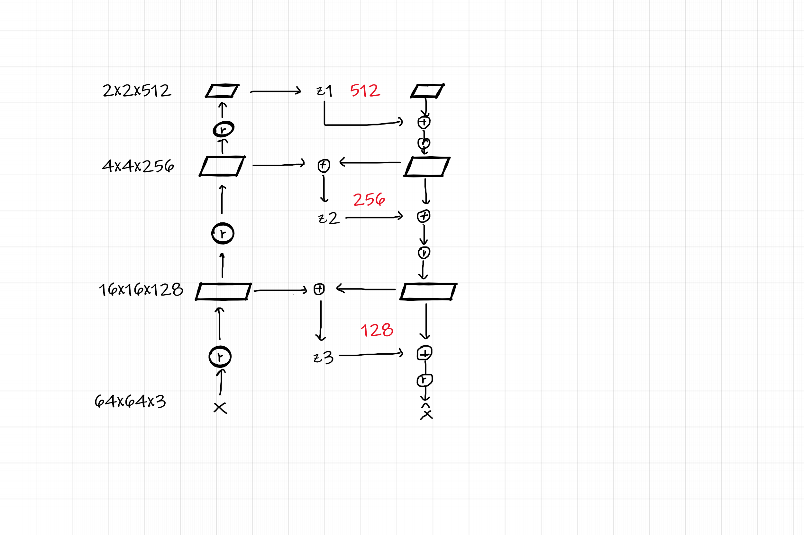
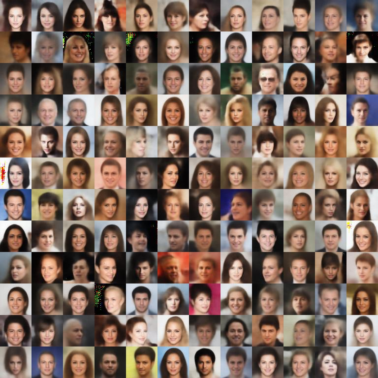
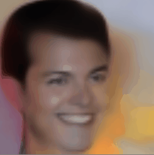
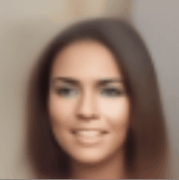
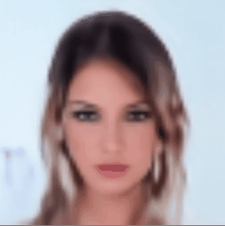

# nvae

An unofficial toy implementation for NVAE [《A Deep Hierarchical Variational Autoencoder》](https://arxiv.org/abs/2007.03898)

This implement is tiny, just for learning and validation, the model structure:



As shown in the figure above, the model architecture is very simple, the image is scaled to 64x64 size, in order to reduce the amount of calculation.

The following ops are not implemented, because they are just some tricks, but they greatly increases the computational complexity:

* IAF
* Discretized mix logistic distribution (Replaced with lighter Adaptive Loss)

## Example



Hair and other details are still blurry, but this is mostly because the image used is a low-quality 64x64 size and the model is realy tiny.


## Usage

### Training

Just specify the image directory, see more with `python train.py -h`. 

```sh
python train.py --dataset_path <img_directory> --batch_size 128
```

During training, the dataloader will capture the central area of the image and
 scale it to 64 x 64, and the checkpoints will be saved into `checkpoints` directory.


### Generate images

Replacing the default checkpoint path in the file `random_sample.py` and run example as follow:

```sh
python random_sample.py
```

or generate a 768 x 768 image contains 144 sub-imgs:

```sh
python gen_imgs.py
```

## Variable control experiment

The highest-level variables control advanced attributes such as face shape, hairstyle, background, gender, and direction:



Secondary variables seem to control facial muscles:



The lowest-level variables seem to be just some noise:

