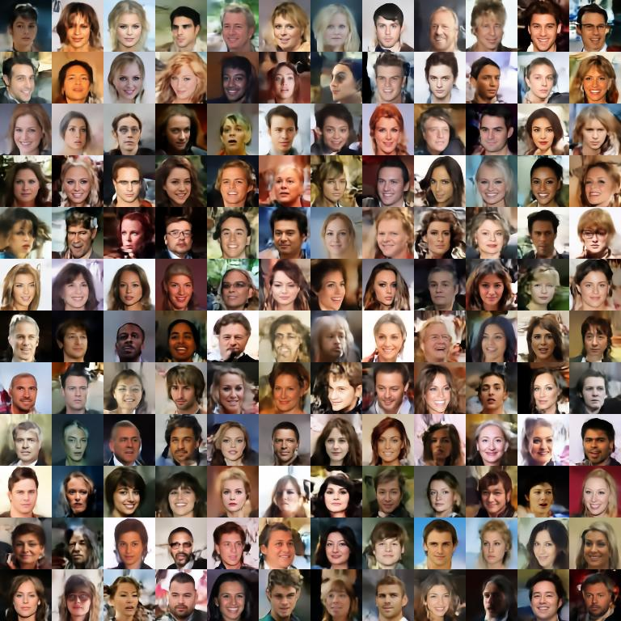

# nvae

An unofficial toy implementation for NVAE [《A Deep Hierarchical Variational Autoencoder》](https://arxiv.org/abs/2007.03898)

This implement is tiny, just for learning and validation, the model structure:

As shown in the figure above, the model architecture is very simple, the image is scaled to 64x64 size, in order to reduce the amount of calculation.

## example

Hair and other details are still blurry, but this is mostly because the image used is a low-quality 64x64 size.

And, en, some background pixels exploded, perhaps due to recursive features.
